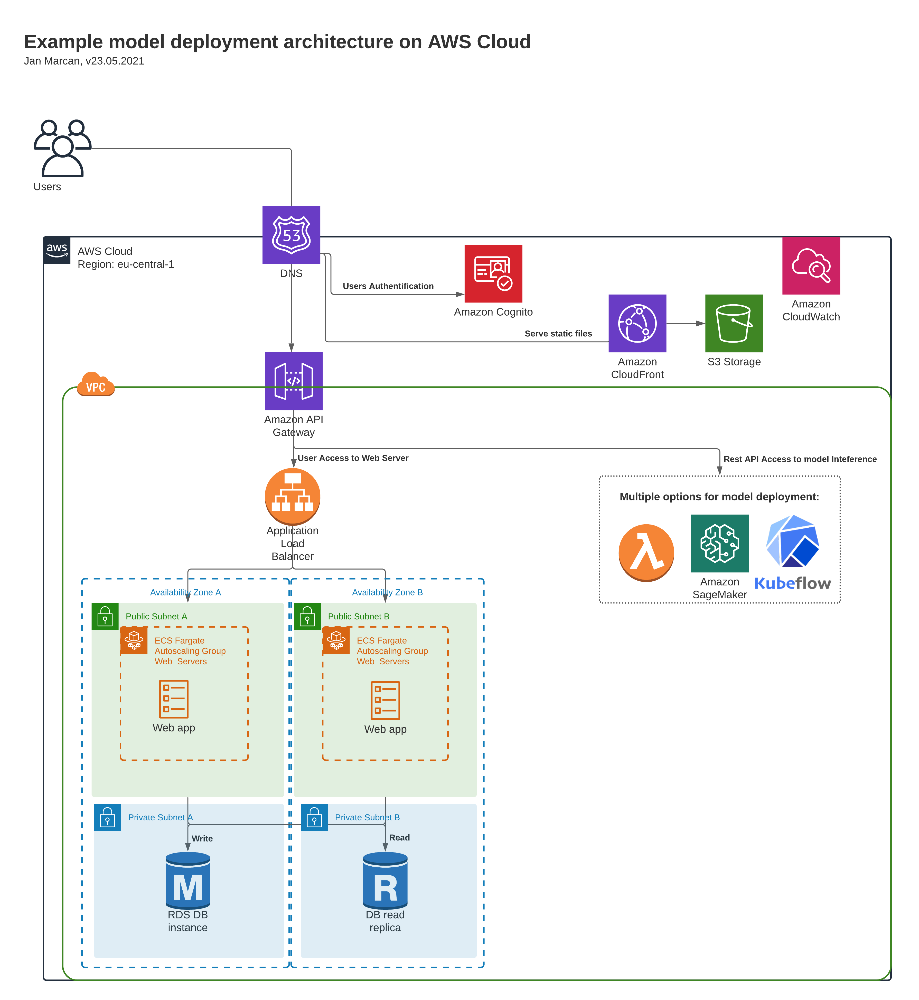

# ML Model Deployment to Production

Below sharing a sample architecture I did in the past.

- The architecture is designed to serve users 24/7, 
providing the interface in real-time, 
and scaling automatically with the load to serve up to thousands of requests per day.
- The network response time is optimized for customers located in Switzerland  
while covering the whole Western Europe with 23ms to reach distant Ireland.  
Integration with USA is possible with 147 ms to reach California.
- The web server is optimized to provide immediate response to users 
while minimizing maintenance & costs for infrequent access with AWS Fargate.
- The interference pipeline supports several options from AWS Lambda[1], AWS SageMaker, to my favourite KubeFlow.

[1] Using AWS Lambda for interference is possible only when run time is below 300s with maximum memory of 3048 MB.