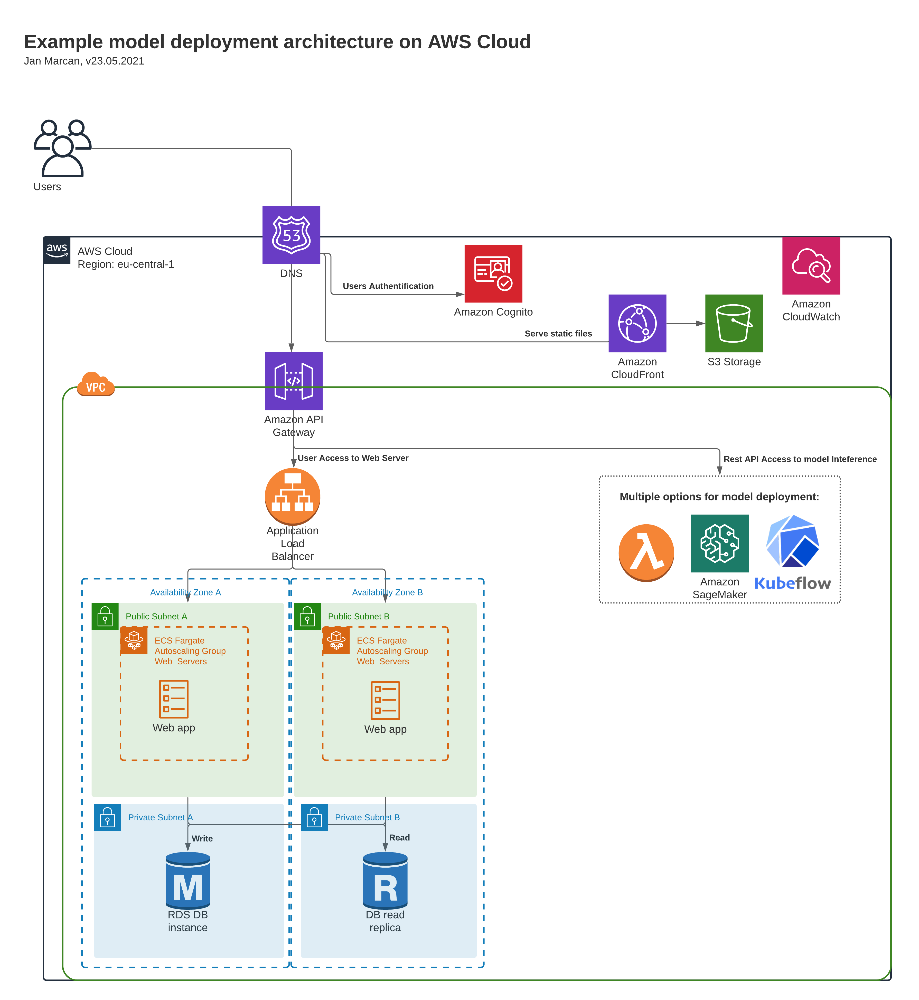

# System Design for Model Deployment to Production

Let's take a look here how can be designed an architecture 
serving machine learning model interference via web application.

There is only a few things so rewarding 
as seeing your work in production serving to others.  
Be it 5, 100, or million users. 
 
To scale from zero to millions,  we need to think about the overall system design  that can look like on the picture below:

- This architecture is designed to serve users 24/7, 
providing the interface in real-time, 
and scale automatically with the load.
- The web server is optimized to provide immediate response to users 
while minimizing maintenance & costs for infrequent access with AWS Fargate.
- The network response time is optimized for customers located in Switzerland 
while covering the whole Western Europe with 23ms to reach distant Ireland.
- The interference pipeline supports several options from traditional computing services, to AWS SageMaker, to my favourite KubeFlow.

Now, what are the main steps to get design for your use-case?

## 1. Microservices decomposition
In the first step, we can decompose the whole setup into microservices.  
That offers us several advantages: 
1. Better scalability where each component can be scaled independently based on its load. 
Additionally, each microservice can run on its own optimal harware.  
Imagine that your interference pipeline requires GPU.   You don't want to pay for expensive GPU to run your web app.
2. Both parts can be easily entrusted to different people or teams  
and handled independently including their CI/CD pipelines.

For this example we can split it into:
- I. Dockerized and application web-server
- II. Dockerized and interference pipeline exposed via REST API

## 2. Scaling-service selection
In the second step, we can focus on how we run and scale each microservice.

I will use here AWS services, 
but the though process is the same for any other cloud provider. 
If you use Microsoft Azure or Google Cloud Platform 
you can just replace the services here for twins of your provider.

### 2.1. Scaling-service for Application Webserver
For webserver deployment we have the following options:
- a) Kubernetes spinning traditionall servers (AWS ECS: EC2)
    - Ideal when we face stable load and need to keep control about underlaying hardware  
    Cons: Maintaince of servers, updates, etc. 
    Pros: Flexibility, the most price effective for constant load
- b) Serverless (AWS Lambda)
    - Ideal when the service is not accessed most of the time  
    and user can tollerate response delay due to cold starts of lambda container 
    Cons: Cold starts that makes your user wait  before lambda starts your container 
    Pros: No maintaince of servers or images, you just provide the code. 
    You are charged for number of times the function is called. Not for idle CPU time.
- c) Kubernetes spinning containers (AWS ECS: AWS Fargate) 
    - Ideal when we want immediate response to users 
    while don't want to spend time maintaining the servers 
    Cons: Maintaince of containers in contrast with serverless lambda 
    Pros: No need to maintain servers in consrast with EC2.  
    You pay for CPU time you use. Not for idle CPU time as with EC2. 

For this case I went with using AWS Fargate (c).

### 2.2. Scaling-service for Model deployment
Now things get interesting. 
In addition to scaling and monitoring service health, 
you want to monitor ML-specific things 
like model accuracy or data drifts 
so you know when is time to retrain your model. 

You can use general computing services mentioned above ,
and take care about logging ML-specific things on your model level 
using built-in Cloud Watch or open-source Prometheus with Grafana.

Or you can use tooling specialized for model deployment
that has this monitoring by default.

Your choice is between 
cloud-native solution which is Sagemaker for AWS 
or open-source solution you integrate with ECS when my first choice would be Kubeflow.

## 3. Database selection
When you scale from zero to million users 
it's the database scaling that causes worries.

Your choice is between traditional relational databases like PostgreSQL 
or noSQL solutions like MongoDB.

For this case it was about handling relational data 
making it easy for me to stick with relational database.  
However, it would work the same with noSQL 
that would offer advantage of horrizontal scaling.

## 4. Model deployment

The beauty of this microservices architecture  
is that the model interference pipeline is a black box  
where we just call defined entry point serving as model load balancer.

The deployment after the model retraining is matter of CI/CD pipeline.  
With blue-green deployment, the CI/CD pipeline deploys new instances with the new version  
and redirect the traffic to this new version.

## Summary
We went through possible system design 
serving machine learning model interference via web application 
and necessary engineering behind to scale from zero to million of users.

Now depending on the intended scale  
several more technique could be applied  
as horizontal scaling of read replicas, caching,  
or using message queues to provide buffer for sudden spikes.
